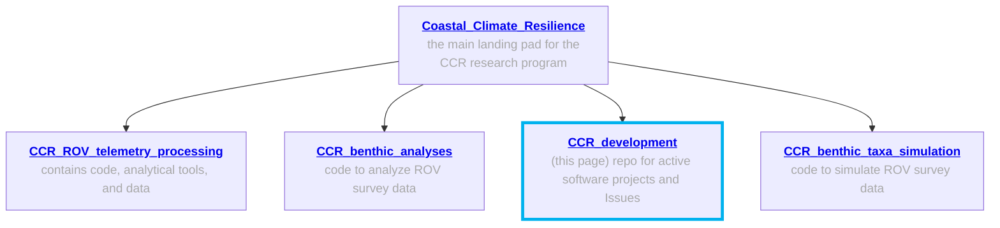

# CCR active development 

This repo serves as a landing pad for active areas of development of our Coastal Climate Resilience (CCR) program. Specifically, this repo houses 1-pager .md documents ready for development, and also a hub to communicate via the Issues tab. 

### Other CCR GitHub repositories

### 1-pager project descriptions 
<table>
  <tr> <td> <b> <a href="https://github.com/zhrandell/Seattle_Aquarium_CCR_development/blob/main/1-pagers/DVL_beam_splitter.md"> DVL_beam_splitter </a> </b> </td> <td> Create a BlueOS extension to log and view the x4 DISTANCE_SENSOR messages from the DVL </td> </tr>
  <tr> <td> <b> <a href="https://github.com/zhrandell/Seattle_Aquarium_CCR_development/blob/main/1-pagers/GNSS_compass_logging.md"> GNSS_compass_logging </a> </b> </td> <td> Modify a BlueOS extension to log a satellite compass' topside GPS, compass, and pitch and roll data  </td> </tr>
  <tr> <td> <b> <a href="https://github.com/zhrandell/Seattle_Aquarium_CCR_development/blob/main/1-pagers/USBL_acoustic_logging.md"> USBL_acoustic_logging </a> </b> </td> <td> Modify a blueOS extension to log the raw acoustics from a USBL system </td> </tr>
  <tr> <td> <b> <a href="https://github.com/zhrandell/Seattle_Aquarium_CCR_development/blob/main/1-pagers/bull_kelp_tracking.md"> bull_kelp_tracking </a> </b> </td> <td> Identify a computer vision path forward for detecting and tracking bull kelp stipes </td> </tr>
  <tr> <td> <b> <a href="https://github.com/zhrandell/Seattle_Aquarium_CCR_development/blob/main/1-pagers/KelpNet.md"> KelpNet </a> </b> </td> <td> Create an image classifier platform for kelp and substrate </td> </tr>
  <tr> <td> <a href="https://github.com/zhrandell/Seattle_Aquarium_CCR_development/blob/main/1-pagers/USBL_DVL_post-processing.md"> <b> USBL_DVL_post-processing </b> </a> </td> <td> Generate ROV track logs by combining DVL and USBL post-flight </td> </tr>
  <tr> <td> <a href="https://github.com/zhrandell/Seattle_Aquarium_CCR_development/blob/main/1-pagers/localization_fixit.md"> <b> ArduSub Localization Fixit </b> </a> </td> <td> BlueOS extension to diagnose and fix common localization problems </td> </tr>
 </table>

<!---  <tr> <td> <a href="URL"> <b> TITLE </b> </a> </td> <td> DESCRIPTION </td> </tr>  -->

## Other resources
* To access our main GitHub landing page for the CCR program, see [Seattle_Aquarium_Coastal_Climate_Resilience](https://github.com/zhrandell/Seattle_Aquarium_Coastal_Climate_Resilience). 
* To access a repo with various analytical resources, see [Seattle_Aquarium_CCR_analytical_resources](https://github.com/zhrandell/Seattle_Aquarium_CCR_analytical_resources).
