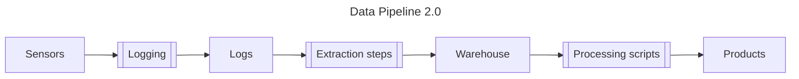

# Data Pipeline 2.0

## Overview

## Sensors

### Vessel-side

#### GNSS Compass

* Description: Advanced Navigation INS; dual-antenna GPS, RTKl;  IMU?  (plus some processing)
* Rate: 200 Hz
* Output: position ± 0.01m (wrt which frame? I’m guessing this is {lat,lng,alt} ?)
* Output: orientation [RP ± 0.4°, Y ± 0.2°] (wrt which frame? )

#### USBL G2

* Description: UGPS G2 box
* Output: {roll, pitch} (processed) ? ← for which i guess must have a gyro?
* Output: acceleration (raw) ? 

#### USBL Antenna

* Description: UGPS antenna, receives U1 locator signal
* Output: range & bearing to ROV (processed)

### ROV-side

#### U1-locator

* Description: acoustic transmitter to UGPS antenna

#### DVL

* Description: DVL-A50, performance model
* Output: sensor body-frame velocity (processed)
* How processed: ?
* Logs generated: ?
* Rate: ?
* Covariance: ?

#### Barometer

* Description: Bar30 sensor
* Output: depth (processed, single scalar) ?

#### Compass

* Description: 2 compass chips on the Blue Robotics Navigator Pi Hat. Only 1 compass is used at a time, the other is logged but not evaluated. If the current compass performs poorly (the EKF innovation is too high, for other reasons) then the EKF switches to the other compass.
  * MMC5983
  * AK09915
* Output: global yaw (processed, single scalar) ?

#### IMU

* Description: gyro + accel sensors, 1 chip on the Navigator Pi Hat
   * ICM-20602
* Output: acceleration (raw)
* Output: angular rate (raw)

## Logs

TODO

## Warehouse

TODO describe file location(s), organization, naming conventions

## Products

### 1-Hz Telemetry

#### What

A replacement for the QGC-generated csv file.

#### Processing

A script will extract messages from a tlog file, downsample to 1Hz, and write the results to a csv file.
The script will use the same fields and methods as QGC, so the results should be the same.

#### Motivation

* Keep the current R scripts
* Avoid QGC issues and version differences (TODO reference known issues)
* Support migration to Cockpit in the future

### Photogrammetry

TODO