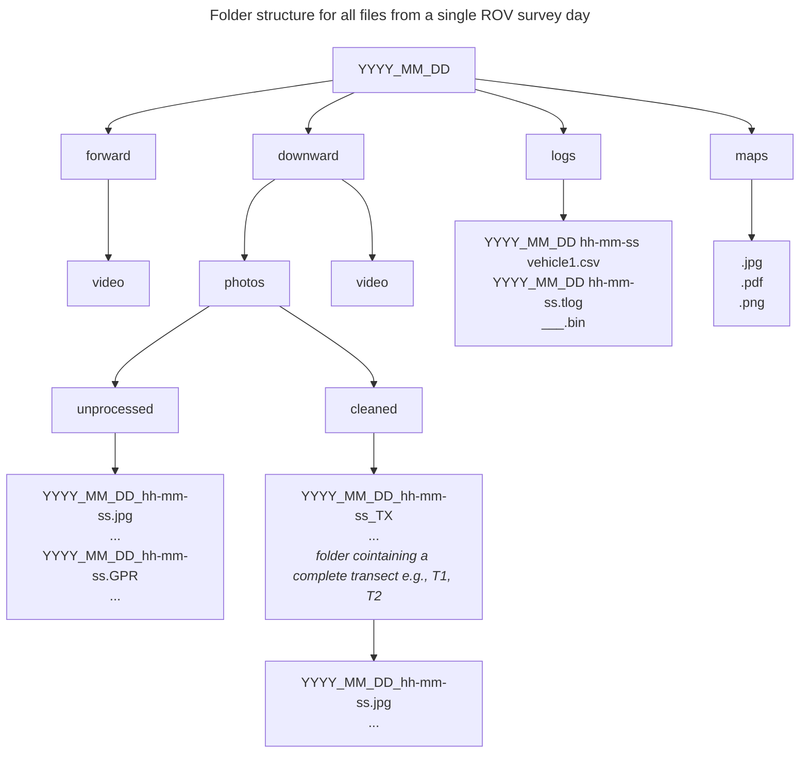

# Data Pipeline 2.0

## Overview

## Sensors

### Vessel-side

#### GNSS Compass

* Description: Advanced Navigation INS; dual-antenna GPS, RTKl;  IMU?  (plus some processing)
* Rate: 200 Hz
* Output: position ± 0.01m (wrt which frame? I’m guessing this is {lat,lng,alt} ?)
* Output: orientation [RP ± 0.4°, Y ± 0.2°] (wrt which frame? )
* Links: ([website](https://www.advancednavigation.com/inertial-navigation-systems/satellite-compass/gnss-compass/#Documentation), [datasheet](https://www.advancednavigation.com/wp-content/uploads/2024/05/GNSS-Compass-Datasheet.pdf), full [user-guide](https://docs.advancednavigation.com/gnss-compass/Introduction.htm))

#### USBL G2

* Description: UGPS G2 box
* Output: {roll, pitch} (processed) ? ← for which i guess must have a gyro?
* Output: acceleration (raw) ?
* Links: [website](https://waterlinked.com/underwater-gps-g2), [datasheet](https://waterlinked.com/web/content/7540?unique=2f809a254e2fc004fc3918bd5a5c4219c771d812)

#### USBL Antenna

* Description: UGPS antenna, receives U1 locator signal
* Output: range & bearing to ROV (processed)
* Links: [website](https://waterlinked.com/shop/underwater-gps-antenna-102?category=2#attr=)

### ROV-side

#### U1-locator

* Description: acoustic transmitter to UGPS antenna
* Link: [website](https://waterlinked.com/shop/underwater-gps-g2-locator-u1-122?category=2#attr=)

#### DVL

* Description: WaterLinked DVL-A50, performance model
* Output: sensor velocity, body frame {forward, right, down}
  * MAVLink.VISION_POSITION_DELTA.time_delta_usec = dt * 1e6
  * MAVLink.VISION_POSITION_DELTA.angle_delta = ω * dt
  * MAVLink.VISION_POSITION_DELTA.position_delta = v * dt
  * MAVLink.VISION_POSITION_DELTA.confidence = 100 * (1 - min(0.4, σ) / 0.4)
  * Data is from the _Velocity-and-transducer report_, which is not processed by the on-board EKF
  * Rate is 2-15 Hz, changes with altitude
* Position relative to ROV origin {forward, right, down}: ?
* Links: [website](https://waterlinked.com/shop/dvl-a50-114#attr=8,53,192), [user-guide](https://waterlinked.github.io/dvl/dvl-a50/), [driver](https://github.com/bluerobotics/BlueOS-Water-Linked-DVL/)
* Notes
  * Current firmware version: I think 2.4.4? No need to upgrade to 2.5.2, we do not need PD4 protocol support
  * Long term accuracy is listed as ±0.1%

#### Barometer

* Description: Bar30 sensor
* Output: depth (processed, single scalar) ?
* Links: [website](https://bluerobotics.com/store/sensors-cameras/sensors/bar30-sensor-r1/)

#### Compass

* Description: 2 compass chips on the Blue Robotics Navigator Pi Hat. Only 1 compass is used at a time, the other is logged but not evaluated. If the current compass performs poorly (the EKF innovation is too high, for other reasons) then the EKF switches to the other compass.
  * MMC5983 ([website](https://www.memsic.com/magnetometer-5), [datasheet](https://www.memsic.com/magnetometer-5))
  * AK09915 ([website](https://www.akm.com/us/en/products/electronic-compass/lineup-electronic-compass/ak09915c/))
* Output: global yaw (processed, single scalar) ?

#### IMU

* Description: gyro + accel sensors, 1 chip on the Navigator Pi Hat
   * ICM-20602 ([website](https://invensense.tdk.com/products/motion-tracking/6-axis/icm-20602/), [datasheet](https://invensense.tdk.com/download-pdf/icm-20602-datasheet/))
* Output: acceleration (raw)
* Output: angular rate (raw)

## Logs

### Telemetry (tlog)

This is a record of the MAVLink messages received.
The local time (UNIX epoch) is recorded with each message as it is logged.

These files can contain messages from multiple MAVLink sources (sysid, compid tuples).
Tools should filter by MAVLink source.

There are currently 2 systems writing tlog files:
1. QGroundControl: the timestamp is the laptop system time.
2. mavlink-router: the timestamp is the Raspberry Pi system time. _Not tested_

Note that mavlink-router (the recommended router) has a bug where some number of messages are occasionally dropped.
These messages are not routed to QGroundControl, so they are not logged.
See https://github.com/bluerobotics/BlueOS-Water-Linked-DVL/issues/44

### Dataflash (BIN)

TODO

### QGroundControl down-sampled csv file

TODO

## Warehouse

## Products

### 1-Hz Telemetry

#### What

A replacement for the QGC-generated csv file.

#### Processing

A script will extract messages from a tlog file, downsample to 1Hz, and write the results to a csv file.
The script will use the same fields and methods as QGC, so the results should be the same.

#### Motivation

* Keep the current R scripts
* Avoid QGC issues and version differences (TODO reference known issues)
* Support migration to Cockpit in the future

### Photogrammetry

TODO
